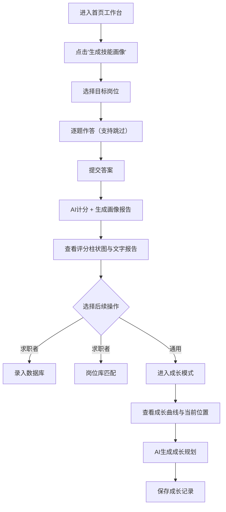
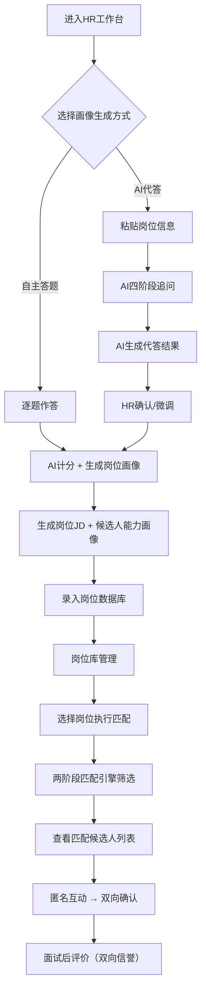
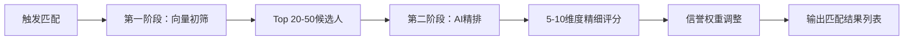

## 1. 产品概述

智聘·双向精准匹配引擎是一款通过"题库测评 + AI辅助计分"实现**人才画像标准化**、**去标签化双向匹配**、**动态信誉评价**，并为求职者提供**可视化成长追踪**的智能招聘平台。

- **主要用途**：为求职者和HR提供一个基于能力的公平匹配平台，消除学历、年龄等标签偏见，通过标准化测试和AI评分构建客观的能力画像
- **目标用户**：有经验的求职者、应届大学生、企业HR/用人部门
- **Demo阶段聚焦岗位**：AI工程师、3D建模师

---

## 2. 核心功能

### 2.1 用户角色

| 角色 | 使用模式 | 核心权限 |
|------|----------|----------|
| 求职者 | 求职者模式 | 技能测试 → 画像生成 → 成长追踪 → 岗位匹配 |
| 大学生 | 大学生模式 | 技能测试 → 画像生成 → 成长追踪 |
| HR | HR模式 | 岗位画像生成 → 岗位库管理 → 人才匹配 → 信誉评价 |

### 2.2 功能模块

1. **首页工作台**：三种用户模式的统一功能导航中心，风格一致
2. **题库测评页面**：基于预设题库的标准化答题流程，支持跳过机制
3. **AI画像生成页**：AI辅助计分、维度评分星级、横向柱状图、文字画像报告
4. **成长模式页**：成长曲线可视化、当前位置标记、AI成长规划、历史对比
5. **HR画像生成页**：双模式（自主答题/AI代答），四阶段引导，结构化文档输出
6. **岗位库管理页**：HR岗位列表、删除、匹配操作
7. **双向匹配页**：基于能力的语义匹配，两阶段引擎，匿名互动，信誉权重
8. **信誉评价页**：面试后双向评价，星级+文字，信誉档案展示

### 2.3 页面详情

| 页面名称 | 模块名称 | 功能描述 |
|----------|----------|----------|
| 首页工作台 | 模式切换标签栏 | 顶部"求职者/大学生/HR"三个标签，切换时重置进度 |
| 首页工作台 | 求职者工作台 | "生成技能画像"按钮、"岗位库匹配"按钮、历史画像列表（时间、岗位、评分、查看/删除） |
| 首页工作台 | 大学生工作台 | "生成技能画像"按钮、历史画像列表、成长模式入口 |
| 首页工作台 | HR工作台 | "生成岗位画像"按钮、"岗位库管理"入口、"匹配人才库"入口 |
| 岗位选择页 | 岗位选择 | 选择AI工程师或3D建模师，大学生可选1-2个方向 |
| 题库测评页 | 答题流程 | 逐题展示，支持跳过，进度条显示，不调用AI |
| 题库测评页 | HR-AI代答模式 | 文本输入框粘贴岗位信息，AI代答，四阶段引导对话 |
| 画像结果页 | 评分结果 | 各维度百分制得分、星级评定、横向柱状图 |
| 画像结果页 | 文字画像报告 | AI生成的专属人物画像/岗位画像文字报告 |
| 画像结果页 | 操作区 | "录入数据库"按钮、"进入成长模式"按钮（求职者/大学生） |
| 成长模式页 | 成长曲线 | 预设曲线图（初级→中级→高级→专家），当前位置标记 |
| 成长模式页 | AI成长规划 | 技能补足建议、学习资源推荐、项目实践方向 |
| 成长模式页 | 历史对比 | 新旧节点同时显示，连线标记进步轨迹 |
| 岗位库管理 | 岗位列表 | 岗位名称、创建时间、状态，单个删除和匹配操作 |
| 双向匹配页 | 匹配结果 | 按匹配度降序列表，契合点和差距项说明，信誉档案展示 |
| 双向匹配页 | 匿名互动 | 隐藏个人信息，仅交换岗位挑战与能力优势 |
| 信誉评价页 | 诚实分评价 | HR对求职者1-5星打分，至少15字理由，预设标签 |
| 信誉评价页 | 反向评价 | 求职者匿名评价面试体验及岗位描述真实性 |

---

## 3. 核心流程

### 3.1 求职者/大学生主流程

### 3.2 HR主流程

### 3.3 匹配流程

---

## 4. 用户界面设计

### 4.1 设计风格

- **主色调**：深海蓝 `#0F1B2D`（背景基调）、科技蓝 `#1A73E8`（主强调色）、青碧 `#00B4D8`（辅助强调色）
- **辅助色**：暖金 `#F0A500`（成就/星级元素）、柔白 `#F8FAFC`（卡片背景）、石板灰 `#475569`（次要文本）
- **按钮风格**：微圆角（8px）+ 柔和阴影 + hover渐变微动，主按钮实色填充，次按钮描边透明
- **字体层级**：标题使用加粗的几何无衬线字体，正文使用清晰易读的无衬线字体
- **布局风格**：卡片式布局 + 顶部固定导航 + 左侧边栏（桌面端），移动端底部Tab切换
- **图标风格**：线性图标 + 精选填充图标用于强调状态（如星级、完成标记）
- **质感**：磨砂玻璃效果（glassmorphism）用于导航和弹窗，微渐变背景，卡片柔和投影

### 4.2 页面设计概览

| 页面名称 | 模块名称 | UI元素 |
|----------|----------|--------|
| 首页工作台 | 模式切换标签栏 | 顶部固定，三个等宽标签，活跃标签高亮下划线动画，切换时有淡入过渡效果 |
| 首页工作台 | 求职者工作台 | 居中大卡片布局，主CTA按钮带微光扫过动画，历史画像时间轴列表，每条可hover展开 |
| 首页工作台 | 大学生工作台 | 与求职者一致风格，成长模式卡片带渐变边框，营造"成长"氛围 |
| 首页工作台 | HR工作台 | 三列功能卡片，每张卡片带图标+标题+描述，点击进入对应功能 |
| 岗位选择页 | 岗位卡片 | 两个大卡片水平排列（AI工程师/3D建模师），卡片带图标插图，hover上浮+阴影加深 |
| 题库测评页 | 答题区 | 居中窄卡片（max-w 720px），题目编号+进度条在顶部，选项单选按钮组，跳过按钮在底部 |
| 题库测评页 | AI代答输入 | 多行文本框（min-h 200px），placeholder引导提示，提交后显示AI追问对话气泡 |
| 画像结果页 | 评分柱状图 | 横向柱状图，每个维度一条彩色渐变条+分数标签，整体带圆角容器 |
| 画像结果页 | 文字报告 | 富文本卡片，分段标题+正文，关键分数高亮显示，底部分享/录入操作栏 |
| 成长模式页 | 成长曲线 | SVG曲线图，横轴阶段标注，纵轴分数刻度，当前位置高亮圆点+脉冲动画，历史节点连线 |
| 成长模式页 | AI规划卡片 | 分段建议卡片组（技能补足/学习资源/项目实践），可折叠展开 |
| 岗位库管理 | 岗位表格 | 响应式表格，移动端卡片堆叠，每行操作按钮（匹配/删除），删除需二次确认弹窗 |
| 双向匹配页 | 匹配列表 | 排名列表，每项显示匹配度环形图+关键契合点+差距项，顶部筛选/排序工具栏 |
| 信誉评价页 | 评价表单 | 星级评分组件（可hover预览），标签多选组，文字评价输入框带字数统计 |

### 4.3 响应式设计

- **桌面端优先**（≥1024px）：完整三栏/双栏布局，侧边导航或顶部标签
- **平板端**（768px-1023px）：单栏居中布局，卡片宽度自适应，表格转为卡片堆叠
- **移动端**（<768px）：全屏单列，顶部标签收缩为下拉或图标按钮组，答题区全宽，底部固定操作栏
- **触摸优化**：按钮最小点击区域44×44px，卡片间充足间距，滑动操作支持

---

## 5. 非功能性需求

- 页面加载动画：首次进入有品牌logo渐显+主界面元素依次淡入
- 答题进度保存：浏览器本地存储，刷新不丢失
- 无障碍：关键操作支持键盘导航，色彩对比度符合WCAG AA标准
- 性能：首屏加载<2s，动画帧率≥30fps