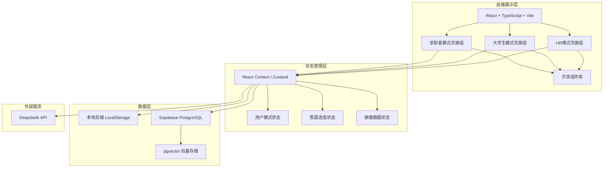
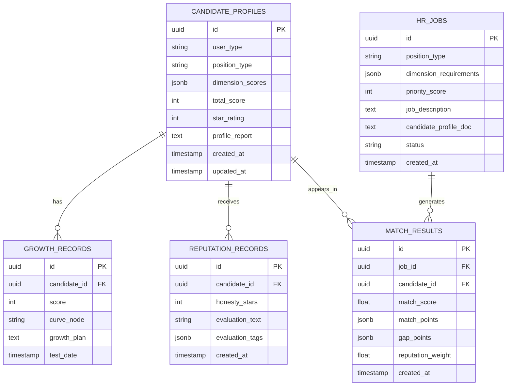

## 1. 架构设计



## 2. 技术说明

- **前端框架**：React 18 + TypeScript + Vite
- **样式方案**：Tailwind CSS 3 + CSS Modules（自定义动画和复杂样式）
- **状态管理**：Zustand（全局状态）+ React Context（模式切换）+ LocalStorage（答题进度持久化）
- **路由**：React Router v6
- **图表渲染**：Recharts（柱状图、成长曲线）
- **动画**：Framer Motion（页面过渡、微交互）
- **HTTP客户端**：Axios / Fetch API
- **数据库**：Supabase (PostgreSQL + pgvector)
- **AI服务**：DeepSeek API (`deepseek-v4-flash`)，通过后端服务调用
- **项目初始化**：npm create vite@latest

## 3. 路由定义

| 路由 | 页面 | 说明 |
|------|------|------|
| `/` | 首页工作台 | 根据当前模式显示对应工作台 |
| `/select-position` | 岗位选择页 | 选择AI工程师或3D建模师 |
| `/quiz` | 题库测评页 | 标准答题流程 |
| `/quiz/hr-ai` | HR-AI代答页 | AI代答+四阶段引导 |
| `/result` | 画像结果页 | 评分柱状图+文字报告 |
| `/growth` | 成长模式页 | 成长曲线+AI规划 |
| `/hr/jobs` | 岗位库管理 | 岗位列表管理 |
| `/hr/jobs/:id` | 岗位详情 | 单个岗位画像详情 |
| `/match` | 双向匹配页 | 匹配结果展示 |
| `/match/anonymous` | 匿名互动页 | 双向匿名沟通 |
| `/evaluate` | 信誉评价页 | 面试后双向评价 |

## 4. API 定义（后续后端实现）

```typescript
// 评分与画像生成
interface GradeRequest {
  answers: Answer[];
  position: 'ai_engineer' | '3d_modeler';
  evaluationRef: string; // 评价标准文件引用
  profileTemplateRef: string; // 画像模板文件引用
}

interface ProfileResult {
  dimensions: DimensionScore[];
  totalScore: number;
  starRating: number;
  textReport: string;
}

interface DimensionScore {
  name: string;
  score: number; // 0-100
  maxScore: number;
}

// 岗位画像（HR端）
interface HrPositionRequest {
  type: 'self_answer' | 'ai_assist';
  rawDescription?: string;
  answers?: Answer[];
  position: 'ai_engineer' | '3d_modeler';
}

// 匹配请求
interface MatchRequest {
  positionId: string;
  positionType: 'ai_engineer' | '3d_modeler';
  stage: 'vector_screening' | 'ai_ranking';
  candidates?: CandidateProfile[];
}

interface MatchResult {
  candidateId: string;
  matchScore: number;
  matchPoints: string[];
  gapPoints: string[];
  reputationScore: number;
}
```

## 5. 数据模型

### 5.1 数据模型定义



### 5.2 本地存储结构

```typescript
// LocalStorage 答题进度
interface QuizProgress {
  mode: 'jobseeker' | 'student' | 'hr';
  position: 'ai_engineer' | '3d_modeler';
  currentQuestionIndex: number;
  answers: Record<number, string>;
  skippedQuestions: number[];
  timestamp: number;
}
```

## 6. 组件树

```
App
├── Layout
│   ├── Header (模式切换标签栏 + Logo)
│   └── MainContent
├── Pages
│   ├── DashboardPage (首页工作台)
│   │   ├── JobseekerDashboard
│   │   │   ├── CTACard (生成技能画像)
│   │   │   ├── MatchButton (岗位库匹配)
│   │   │   └── HistoryTimeline (历史画像列表)
│   │   ├── StudentDashboard
│   │   │   ├── CTACard
│   │   │   ├── HistoryTimeline
│   │   │   └── GrowthEntry (成长模式入口)
│   │   └── HRDashboard
│   │       ├── ProfileGenCard (生成岗位画像)
│   │       ├── JobManageCard (岗位库管理)
│   │       └── MatchCard (匹配人才库)
│   ├── PositionSelectPage
│   │   └── PositionCard (x2)
│   ├── QuizPage
│   │   ├── ProgressBar
│   │   ├── QuestionCard
│   │   ├── OptionGroup
│   │   └── SkipButton
│   ├── HRAssistPage
│   │   ├── DescriptionInput (多行文本框)
│   │   └── DialogueBubble (四阶段对话)
│   ├── ResultPage
│   │   ├── ScoreBarChart (横向柱状图)
│   │   ├── ProfileReport (文字画像报告)
│   │   └── ActionBar (录入/成长/匹配)
│   ├── GrowthPage
│   │   ├── GrowthCurve (SVG成长曲线)
│   │   ├── CurrentMarker (当前位置标记)
│   │   └── GrowthPlanCards (AI规划卡片)
│   ├── HRJobManagePage
│   │   ├── JobTable (岗位表格)
│   │   └── DeleteConfirmModal
│   ├── MatchPage
│   │   ├── MatchFilterBar
│   │   ├── CandidateRankList
│   │   │   └── MatchCard (匹配度环形图+契合点)
│   │   └── ReputationBadge (信誉标签)
│   └── EvaluatePage
│       ├── StarRating
│       ├── TagSelector
│       └── TextReviewInput
└── Shared Components
    ├── Modal
    ├── Toast
    ├── LoadingSpinner
    ├── EmptyState
    └── ConfirmDialog
```